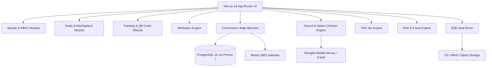

# LUMO System Architecture

**Platform Owner:** LotusRise Company Limited (Tanzania, East Africa)  
**Governing Principle:** Money follows genuine and independently verifiable economic activity.

---

## 1. Architectural Style: Modular Monolith

LUMO is architected as a clean **Modular Monolith** using Next.js 16 (App Router), React 19, TypeScript (strict mode), and Tailwind CSS 4. Domain modules own all business logic, while presentation components compose views and interact via typed services.

---

## 2. Domain Module Boundaries

- `src/modules/identity`: User authentication, session management, multi-role account assignment, OTP verification.
- `src/modules/organizations`: Multi-tenant business organization profiles, staff memberships, and tenant query isolation.
- `src/modules/deals`: Opportunity creation engine, 14-step wizard, deliverable conditions, reward rules, and marketplace filtering.
- `src/modules/tracking`: Unique tracking links, referral codes, QR code rendering, and touchpoint recording.
- `src/modules/attribution`: First-click, last-click, and promo-code precedence attribution engine.
- `src/modules/commissions`: Decimal-safe reward lifecycle state machine (`TRACKED` → `PENDING` → `VALIDATING` → `APPROVED` → `PAYABLE` → `PAID`) with append-only audit events.
- `src/modules/milestones`: Performance ladders and progressive bonus unlock with duplicate prevention.
- `src/modules/payouts`: Bulk mobile-money disbursal with Maker-Checker segregation of duties.
- `src/modules/tax`: TRA-compliant withholding tax calculations and Partner Earnings Statements.
- `src/modules/dealroom`: B2B and creator contract negotiations, deliverable tracking, and activity timeline.
- `src/modules/risk`: Automated fraud scoring, self-referral detection, velocity burst flags, and manual review queues.
- `src/modules/disputes`: Dispute management and multi-party evidence tracking.
- `src/modules/notifications`: Multi-channel notification dispatcher (In-App, SMS, Email).

---

## 3. Decoupled Provider Layer (`src/lib/providers`)

All third-party external services are accessed exclusively through typed provider interfaces:
- `PaymentProvider` & `PayoutProvider`: Implemented by `MongikePaymentAdapter` and `MongikePayoutAdapter` for Tanzanian mobile money (Vodacom M-Pesa, Airtel Money, Tigo Pesa, Halopesa) and card processing.
- `SmsProvider`: Implemented by `MesejiSmsAdapter` for transactional OTPs and commission alerts.
- `EmailProvider`: Implemented by `SmtpEmailAdapter` (Mailpit in local development).
- `StorageProvider`: Implemented by `S3StorageAdapter` (MinIO in local development).

---

## 4. Security & Compliance Architecture

- **Maker-Checker Control:** Segregation of duties prevents the creator of a financial payout batch from authorizing it.
- **Tenant Isolation:** Every business-scoped record requires an explicit `organizationId` filter.
- **Audit Logging:** Append-only `AuditEvent` entries capture actor, action, timestamp, and correlation ID for all material changes.
- **Strict Decimal Arithmetic:** Integer minor units (`BigInt` / minor units) eliminate floating-point inaccuracies.
