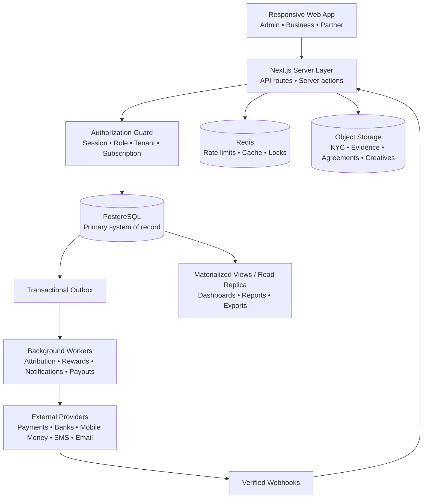
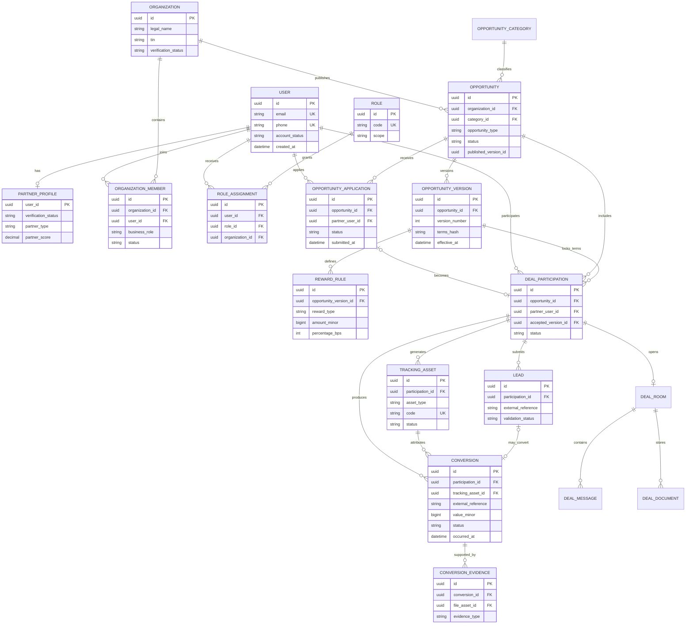
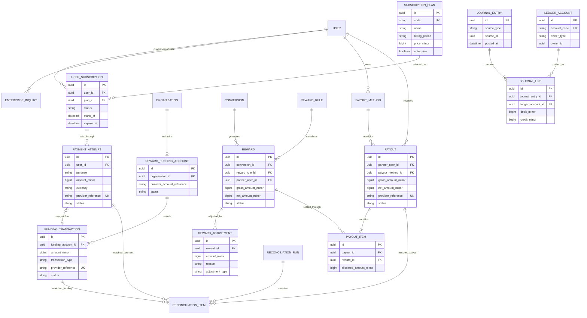
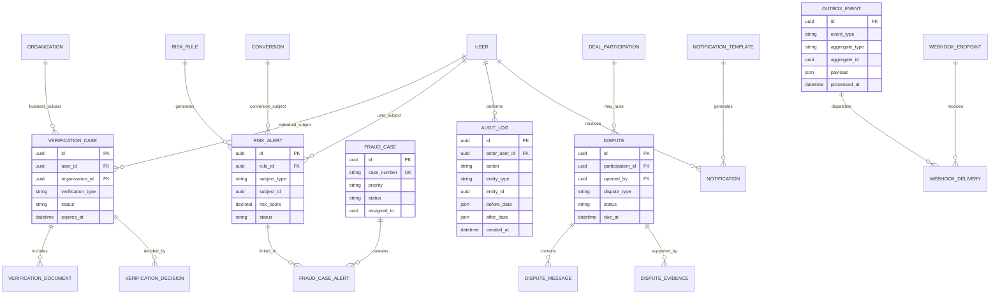

# LUMO Database Design & System Architecture

**Platform Owner:** LotusRise Company Limited (Tanzania, East Africa)  
**Governing Principle:** Money follows genuine and independently verifiable economic activity.  
**Architecture:** Modular Monolith with one single authoritative PostgreSQL database  
**Primary Database:** PostgreSQL 16  
**ORM:** Prisma 7 / Prisma Client 6.19.3 (`prisma/schema.prisma`)  

---

## 1. System Database Architecture



> [!IMPORTANT]
> **PostgreSQL remains authoritative.** Redis must never be used as the permanent source for payments, rewards, or subscriptions. All three portals (Admin, Business, Partner) operate on the same unified database with strict role-based and tenant-scoped permissions.

---

## 2. Identity, Business and Marketplace ERD



> [!NOTE]
> The critical field is `accepted_version_id` in `DEAL_PARTICIPATION`. It locks the exact commercial terms accepted by the Partner even if the Business later publishes an updated Deal version.

---

## 3. Subscription, Reward and Payment ERD



> [!TIP]
> **Double-Entry Balancing Rule:** Every `JOURNAL_ENTRY` must strictly balance:
> $$\sum \text{Debits} = \sum \text{Credits}$$

---

## 4. Verification, Risk, Disputes and Audit ERD



---

## 5. Essential Database Rules

1. **Use UUIDv7 or ULID primary keys:** Primary keys are collision-resistant and time-sortable.
2. **Store money as `BIGINT` minor units:** All monetary values are represented as integers (e.g. 10,000 TZS is stored as integer minor units) — never floating-point numbers.
3. **Add `currency`, normally `TZS`, to every financial record:** Explicit currency ensures multi-currency safety for future cross-border scaling.
4. **Every Business-owned record must contain `organization_id`:** Enforces strict multi-tenant isolation at the database and query layers.
5. **Use soft deletion for users, organizations, and published opportunities:** Set `deleted_at` rather than physically removing records.
6. **Never delete payments, rewards, payouts, journal entries, verification decisions, or audit logs:** Immutable audit records ensure financial and legal compliance.
7. **Store documents in object storage; keep only metadata and file references in PostgreSQL:** Files (KYC, evidence, creatives) reside in MinIO/S3 with metadata stored in `FileAsset`.
8. **Encrypt sensitive identification and payout information:** PII and payment credentials are encrypted at rest.
9. **Use idempotency keys for payments, webhooks, conversions, rewards, and payouts:** Prevents duplicate processing during network retries.
10. **Process notifications and provider calls through a transactional outbox:** Outbox pattern guarantees eventual consistency without distributed transaction failure.

---

## 6. Critical Unique Constraints

```text
OrganizationMember:     UNIQUE (organization_id, user_id)
OpportunityVersion:     UNIQUE (opportunity_id, version_number)
OpportunityApplication: UNIQUE (opportunity_id, partner_user_id)
DealParticipation:      UNIQUE (opportunity_id, partner_user_id)
TrackingAsset:          UNIQUE (code)
Conversion:             UNIQUE (organization_id, external_reference)
PaymentAttempt:         UNIQUE (provider_reference)
FundingTransaction:     UNIQUE (provider_reference)
Payout:                 UNIQUE (provider_reference)
Reward:                 UNIQUE (conversion_id, reward_rule_id, partner_user_id)
PayoutItem:             UNIQUE (payout_id, reward_id)
```

