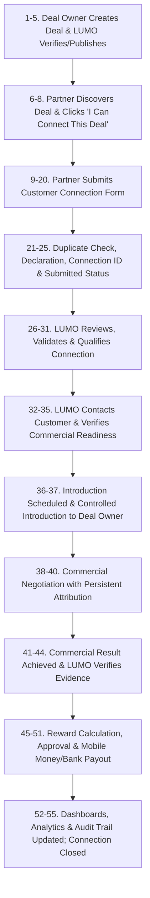

# LUMO Partner Customer Connection Process
## End-to-End Operational & System Specification

**Platform Owner:** LotusRise Company Limited (Tanzania, East Africa)  
**Governing Principle:** Money follows genuine and independently verifiable economic activity.  
**Core Business Rule:** The Partner's job is to bring the Customer to LUMO. LUMO controls the connection, verification, introduction, attribution, commercial-result verification, and reward process. The Partner should never need to recreate the Deal or negotiate the reward independently.

---

## 1. Overview & Purpose

This document details the complete **LUMO Partner Customer Connection Process**, from the initial creation and verification of a Deal by a Deal Owner, through Partner discovery, customer submission, screening, controlled introduction, negotiation, commercial result verification, and final reward settlement.

This specification serves as the authoritative standard for:
- System implementation and data schemas
- Business operating procedures and standard operating procedures (SOPs)
- Partner, Merchant, and Admin onboarding and training
- Product and system documentation

---

## 2. High-Level Process Flow



---

## 3. End-to-End Process Breakdown (Steps 1 to 60)

### Phase I: Deal Creation, Review & Marketplace Publication

#### 1. Deal Owner Creates a Deal
- The process starts when an Individual, Business, or Merchant creates a Deal on LUMO.
- The Deal Owner provides all relevant commercial details:
  - Deal title and description
  - Category and subcategory
  - Commercial requirements and deliverable specifications
  - Images, media, brochures, and supporting documentation
  - Physical or service location (e.g. Dar es Salaam, Arusha, Mwanza, international)
  - Commercial value / deal size
  - Closing date / validity window
  - Reward structure and model
  - Verifiable success condition
  - Any supporting commercial evidence or terms
- **Examples of Deals include:**
  - Vehicle for sale
  - House for rent or sale
  - Supplier requirement
  - Cargo inspection opportunity
  - Product sourcing opportunity
  - Property development opportunity
  - Business acquisition
  - Professional service requirement
  - Technology solution deployment
  - Agriculture and commodity trade opportunity
- *At this stage, the Partner is not yet involved.*

#### 2. LUMO Receives the Deal
- The Deal Owner submits the Deal; it is persisted in the LUMO platform database and enters the internal review workflow.
- The system records:
  - `Deal ID` (UUID / structured identifier)
  - `Deal Owner` (Organization / Individual identity)
  - `Deal Category` and `Deal Type`
  - `Commercial Terms` and currency minor units
  - `Reward Terms` (fixed amount, percentage, tiered, or hybrid)
  - `Closing Date`
  - `Visibility Rules` and access tier
  - `Required Customer Type`
  - `Success Condition` and verification criteria
- The initial status is set to: **`Submitted`** or **`Under Review`**.

#### 3. LUMO Reviews and Verifies the Deal
- LUMO Compliance / Admin team reviews the submitted Deal prior to marketplace publication.
- Verification checks confirm:
  1. The Deal Owner exists, is verified (KYC / KYB), and has valid legal standing.
  2. The Deal description is comprehensive and unambiguous.
  3. The commercial value is realistically stated.
  4. The reward terms and conditions are clearly defined and economically viable.
  5. The Deal requirements and customer prerequisites are understandable.
  6. The success condition is objective and independently verifiable.
  7. The Deal complies with marketplace standards, legal criteria, and ethical guidelines.
  8. All required proof-of-ownership or supporting evidence documents are attached.
- If information is missing or ambiguous, LUMO returns the Deal to the Deal Owner with specific correction notes.

#### 4. Deal Is Approved
- Once the Deal passes compliance review under Maker-Checker controls, LUMO approves it.
- Status transition: **`Under Review` → `Approved`**.
- The Deal is primed for publication according to its configured schedule and visibility rules.

#### 5. Deal Is Published on LUMO
- The Deal becomes visible to the targeted audience across LUMO web and mobile surfaces.
- Visibility configurations:
  - Public visitors
  - Registered users
  - Subscribed Partners (active subscription entitlement)
  - Private Members (exclusive access window)
  - Selected Partner groups or industry syndicates
- The marketplace card presents:
  - Deal cover image and gallery
  - Title and short description
  - Category badge
  - Location
  - Total commercial value
  - Potential reward / commission
  - Access tier / release state
  - Closing date countdown
  - **`View Deal`** action button

---

### Phase II: Partner Discovery & Customer Connection Submission

#### 6. Partner Discovers the Deal
- A registered Partner browses LUMO and discovers an active Deal matching their business network, professional domain, or personal connections.
- **Fundamental Principle:** The Partner does not own the Deal. The Partner's specialized role is to help LUMO find, qualify, and connect the right Customer to the Deal.
- *Example:* A merchant lists a fleet of commercial trucks for sale. The Partner knows a regional logistics enterprise seeking fleet expansion. The Partner's job is to introduce that specific potential buyer to LUMO.

#### 7. Partner Opens the Deal
- The Partner clicks **`View Deal`**.
- LUMO displays complete Deal specifications governed by the Partner's permission level:
  - Commercial description and specifications
  - Buyer/client profile requirements
  - Deal commercial value
  - Potential reward structure
  - Required customer capabilities
  - Geographical location
  - Closing date
  - Objective success condition
- The Partner cannot modify any terms, values, or success conditions set by the Deal Owner.

#### 8. Partner Decides They Can Help
- If the Partner has a qualified, realistic prospect in their network, they click:  
  **`I Can Connect This Deal`**
- This action opens the **Partner Customer Connection Submission Form**.

#### 9. LUMO Pre-Fills the Deal Information
- The connection form automatically inherits and locks Deal parameters:
  - Deal ID
  - Deal Title
  - Deal Category
  - Deal Owner / Merchant profile
  - Deal Commercial Value
  - Reward Structure
  - Closing Date
  - Required Customer Profile
- The Partner is prevented from editing or tampering with any pre-filled Deal terms.

#### 10. Partner Selects Who They Are Connecting
- First form question: **"Who are you connecting?"**
- Selectable entity types:
  - Individual
  - Business / Corporate
  - Institution (Academic, Medical, NGO)
  - Government Entity / Parastatal
  - Association / Cooperative / Trade Union
  - Other

#### 11. Partner Selects the Customer Role
- Form question: **"What role does this Customer have in relation to the Deal?"**
- The options adapt dynamically based on the Deal category:
  - **Vehicle Deal:** Individual Buyer, Company Buyer, Dealer, Fleet Buyer
  - **Property Deal:** Tenant, Buyer, Real Estate Investor, Corporate Occupier, Institution
  - **Agriculture & Commodities:** Buyer, Importer, Distributor, Wholesaler, Processor
  - **Cargo Inspection / Logistics:** Inspection Company, Verification Company, Testing Laboratory, Logistics Company, International Trade Service Provider
  - **Technology & Services:** Enterprise Client, Solution Integrator, Service Contractor, Tech Partner

#### 12. Partner Enters Customer Identity
- The Partner enters accurate contact and identification details:
  - Customer Name / Registered Company Name
  - Primary Contact Person and Designation
  - Country, Region, City, Physical Address
  - Official Phone Number / WhatsApp Number
  - Official Email Address
  - Company Website (where applicable)
- The Partner is required to provide accurate, verified information.

#### 13. Partner Explains Their Relationship With the Customer
- Form question: **"How do you know this Customer?"**
- Selectable options:
  - Direct Personal Contact
  - Existing Customer
  - Existing Business Relationship
  - Professional Contact / Industry Peer
  - Friend or Family
  - Authorized Representative
  - Previous Client
  - Current Client
  - Referral Through Trusted Network
  - Not Yet Contacted
- This declaration establishes the credibility and strength of the prospective introduction.

#### 14. Partner States Whether the Customer Has Been Contacted
- Form question: **"Have you spoken to the Customer about this Deal?"**
- Selectable options:
  - Yes
  - No
  - Not Yet
  - I discussed a similar opportunity
  - I can contact them prior to introduction

#### 15. Partner Indicates Customer Interest
- Form question: **"What is the Customer's interest level?"**
- Selectable options:
  - Confirmed Interest
  - Strong Potential Interest
  - Possible Interest
  - Needs More Information
  - Not Yet Contacted
  - Unknown

#### 16. Partner Confirms Whether LUMO May Contact the Customer
- Selectable options: **`Yes` | `No` | `Not Yet` | `Not Sure`**
- The Partner explicitly confirms that the Customer has consented to having their contact information shared with LUMO for this commercial opportunity.

#### 17. Partner Indicates Customer Suitability
- System qualification prompt: **"Can the Customer meet the Deal requirement?"**
- Selectable options:
  - Fully Capable
  - Appears Capable
  - Partially Capable
  - Need LUMO to Verify
  - Not Sure

#### 18. Partner Selects Relevant Capabilities
- Category-tailored multi-select checkboxes highlight customer competencies.
- *Example (Cargo Inspection Deal):*
  - [ ] Cargo Inspection
  - [ ] Quality Verification
  - [ ] Quantity Verification
  - [ ] Sampling
  - [ ] Laboratory Coordination
  - [ ] Loading Supervision
  - [ ] Export Inspection
  - [ ] Import Inspection
  - [ ] International Trade Compliance
  - [ ] Logistics & Clearing
  - [ ] Certification & Auditing

#### 19. Partner Adds Optional Notes
- The Partner writes a concise briefing note explaining why the Customer is a fit.
- *Example:* "The enterprise operates out of Dar es Salaam and Geneva, holding ISO 17020 cargo inspection accreditation. I met with their commercial director yesterday; they possess active capacity and are waiting for the specifications."

#### 20. Partner Uploads Supporting Information
- The Partner attaches relevant non-confidential documentation:
  - Company profile / Capability deck
  - Business card
  - Product brochure / Specification sheet
  - Relevant operating license / Regulatory certificate
  - Website screenshot / Portfolio excerpt
  - Formal Expression of Interest (EOI) or introductory letter
- Uploads are optional on initial submission but expedite review.

---

### Phase III: System Ingestion, Deduplication & Admin Screening

#### 21. LUMO Performs Automated Duplicate Check
- The system checks whether the Customer has already been submitted for the same Deal across:
  - Phone number (normalized international format)
  - Official email address
  - Business registration / Tax identification number
  - Exact or phonetic company name match
  - Existing open connection records
- **Privacy & Protection Rule:** If a potential duplicate is detected, the second Partner is never shown the identity or details of the first Partner.
- Instead, the system displays a neutral notice:  
  *"This Customer may already be associated with this opportunity. LUMO will review the attribution."*

#### 22. Partner Accepts Legal Declaration
- Prior to submission, the Partner formally accepts the connection declaration:
  1. The information was submitted in good faith and is accurate to the best of their knowledge.
  2. The Customer details are not knowingly falsified or fabricated.
  3. The submission is not an intentional duplication of an existing connection.
  4. Reward eligibility remains strictly contingent upon LUMO's verification of the commercial outcome.
  5. Submission does not create an automatic entitlement to payment.
  6. LUMO reserves sole authority to verify commercial results and resolve attribution.

#### 23. Partner Submits the Customer Connection
- The Partner clicks **`Submit Customer Connection`**.
- The system generates an immutable, unique Connection record with tracking identifier:  
  *Format: `LUMO-CON-000728`*
- The record permanently binds:
  - Partner ID
  - Deal ID
  - Deal Owner ID
  - Customer Profile & Hash
  - Commercial terms and reward formula snapshot
  - Timestamp of submission (UTC)

#### 24. Connection Status Becomes `Submitted`
- Immediate state: **`Submitted`**.
- The Partner receives immediate confirmation:  
  *"Your Customer Connection has been submitted successfully and is awaiting LUMO review."*

#### 25. Connection Appears in Partner Dashboard
- The Connection is immediately visible under:  
  **`Partner Dashboard → My Connections`**
- The display includes:
  - Deal Title
  - Customer Name / Entity
  - Connection ID (`LUMO-CON-000728`)
  - Submitted Date & Time
  - Current Status (`Submitted`)
  - Potential Reward Value
  - **`View Progress`** button

#### 26. LUMO Reviews the Connection
- LUMO Operations / Deal Reviewers evaluate the submission:
  - Legitimacy of Customer identity
  - Direct relevance to the Deal requirements
  - Reachability and validity of contact details
  - Deduplication status
  - Partner-Customer relationship strength
  - Customer interest and consent state
  - Supporting documentation attached

#### 27. LUMO Handles Possible Duplicate Attribution
- In the event of multiple Partners introducing the same Customer for the same Deal, LUMO reviews attribution based on objective criteria:
  1. First valid timestamped submission.
  2. Quality, depth, and verified consent of the submission.
  3. Proven pre-existing commercial relationship.
  4. Documentary evidence provided by the Partner.
  5. Whether the Customer was already an active lead in LUMO or Deal Owner pipeline.
- The final attribution verdict is recorded permanently in the connection audit log.

#### 28. LUMO May Request More Information
- If the submission lacks critical data but appears legitimate, the reviewer transitions the status to:  
  **`More Information Required`**.
- LUMO sends an in-app and SMS/email notification to the Partner:  
  *"Please provide the Customer's official corporate email address and company registration profile."*

#### 29. Partner Provides Additional Information
- The Partner accesses the Connection in their dashboard, attaches the requested details, and resubmits.
- Status transition: **`Resubmitted`**.
- The review enters LUMO's priority review queue.

#### 30. LUMO Rejects Invalid Connections
- If the submission is fabricated, non-responsive, severely deficient, duplicate beyond dispute, or irrelevant:
- Status transition: **`Rejected`**.
- The Partner receives constructive feedback explaining the rejection reason.

#### 31. LUMO Qualifies the Connection
- When the submission meets screening standards:
- Status transition: **`Qualified`**.
- *Milestone Notice:* Passing initial qualification validates the connection but does not yet earn the reward. Commercial realization remains required.

---

### Phase IV: Customer Engagement & Controlled Introduction

#### 32. LUMO Contacts the Customer
- LUMO representatives contact the Customer using the submitted channels (Phone, WhatsApp, Email, or structured consultation).
- Status transition: **`Contacted`**.

#### 33. LUMO Explains the Deal to the Customer
- LUMO briefs the Customer on the opportunity without prematurely disclosing sensitive Deal Owner information.
- The Customer receives sufficient commercial parameters to determine genuine procurement, investment, or service appetite.

#### 34. Customer Confirms Interest
- If the Customer confirms readiness to proceed:
  - Status transition: **`Customer Interested`**.
- If the Customer declines:
  - Status transition: **`Customer Not Interested`** or **`Closed`**.

#### 35. LUMO Verifies Customer Readiness
- Prior to direct introduction, LUMO verifies commercial readiness based on Deal type:
  - Identity & KYC / KYB validation
  - Budgetary allocation / financing availability
  - Sign-off authority of the representative
  - Technical or delivery capacity
  - Compliance documentation
  - Timing and execution readiness

#### 36. LUMO Schedules the Introduction
- When readiness is established, LUMO arranges the introduction between Customer and Deal Owner.
- Status transition: **`Introduction Scheduled`**.

#### 37. Customer Is Introduced to Deal Owner
- LUMO facilitates the structured introduction via:
  - Formal tripartite email introduction
  - Direct teleconference / video conference
  - Dedicated LUMO Deal Room / moderated group
  - Controlled contact exchange with mutual NDAs
- Status transition: **`Introduced`**.

---

### Phase V: Commercial Negotiation & Attribution Tracking

#### 38. Deal Owner Reviews the Customer
- The Deal Owner evaluates the Customer's commercial profile:
  - *Vehicle Seller:* Verifies buyer intent and payment capability.
  - *Cargo Exporter:* Inspects testing accreditations and service contracts.
  - *Property Owner:* Reviews tenant credit and corporate guarantor.
  - *Commodity Supplier:* Assesses buyer Letter of Credit (LC) capability.

#### 39. Commercial Discussion Begins
- Both parties enter formal commercial negotiations:
  - Scope of work, deliverables, and specifications
  - Pricing, terms, and currency
  - Payment schedule and escrow arrangements
  - Delivery timelines and service level agreements (SLAs)
  - Due diligence and definitive contract execution
- Status transition: **`Negotiating`**.

#### 40. LUMO Maintains Persistent Attribution
- **Immutability Invariant:** Direct communication between Customer and Deal Owner does not sever or compromise the Partner's attribution.
- The unique `Connection ID` remains inextricably bound to the Deal, the Customer, and the originating Partner throughout all contract negotiations.

---

### Phase VI: Commercial Result, Verification & Reward Settlement

#### 41. Deal Reaches Commercial Result
- A commercial result is achieved when the Deal's predefined, objective success condition is fulfilled.
- **Representative Examples:**
  - *Vehicle Deal:* Verified completed title transfer and full funds clearance.
  - *Property Deal:* Fully executed lease or title deed transfer with deposit clearance.
  - *Service / Technology Deal:* Executed contract and initial milestone invoice settlement.
  - *Commodity / Trade Deal:* Confirmed shipment delivery and LC clearance.
  - *Cargo Inspection Deal:* Executed multi-year inspection agreement and initial commercial fee settlement.

#### 42. LUMO Receives Evidence of Commercial Result
- Objective documentation is submitted to LUMO:
  - Fully signed commercial contract
  - Bank payment receipt / official tax invoice
  - Delivery confirmation / Bill of Lading
  - Inspection certificate
  - Title transfer or lease agreement

#### 43. LUMO Verifies the Result
- LUMO Compliance verifies the submission:
  1. The transacting Customer matches the Partner's attributed connection.
  2. The Deal Owner confirms transaction completion and receipt of value.
  3. The objective success condition was fully satisfied within the attribution window.
  4. No duplicate claims, self-referrals, or fraudulent activities exist.
  5. No pending cancellations, disputes, or refund conditions remain active.

#### 44. Connection Status Becomes `Successful`
- Upon full administrative verification:
- Status transition: **`Successful`**.
- The Partner's introduction has officially produced a verified commercial outcome.

#### 45. Reward Calculation Begins
- The system retrieves the original locked reward formula from the Deal Version:
  - Fixed Reward Amount (e.g., TZS 500,000)
  - Percentage Commission (e.g., 5% of gross commercial value)
  - Tiered Scale (e.g., progressive percentage based on volume)
  - Hybrid Structure (base retainer + percentage bonus)
- The calculation executes deterministically without subjective modification.

#### 46. Reward Amount Is Calculated
- *Example:*
  - Deal Value: **USD 2,250,000**
  - Reward Model: **5% Commission**
  - Calculated Potential Reward: **USD 112,500** (or local currency equivalent in minor units)
- Precision is enforced using integer minor units (cents / cents of shilling) to avoid rounding drift.

#### 47. Reward Status Becomes `Reward Pending`
- Status transition: **`Reward Pending`**.
- The reward enters the pre-disbursement compliance queue.

#### 48. Final Reward Verification
- LUMO Finance conducts Maker-Checker payout verification:
  - Verification of Partner KYC and tax identification number (TRA TIN)
  - Confirmation of verified payout destination (M-Pesa, Tigo Pesa, Airtel Money, Bank Account)
  - Accurate withholding tax calculation (5% resident / 15% non-resident)
  - Absence of any open disputes or escrow holds

#### 49. Reward Is Approved
- The Checker administrator approves the disbursement.
- Status transition: **`Reward Approved`**.
- The Partner receives an immediate in-app and SMS alert confirming reward approval.

#### 50. Reward Is Processed for Payment
- The payout instruction is transmitted via the integrated payment gateway (e.g., Mongike Mobile Money / Bank Transfer).
- The system logs:
  - Disbursement Amount & Net Amount after statutory withholding tax
  - Currency
  - Payout Method & Provider Reference
  - Execution Timestamp
  - Financial Outbox & Journal Entry IDs

#### 51. Partner Receives Reward
- Status transition: **`Reward Paid`**.
- The Partner receives the funds directly into their verified mobile wallet or bank account.
- The transaction appears under:  
  **`Partner Dashboard → Rewards & Commissions`** with an official Partner Earnings Statement.

---

### Phase VII: Dashboard Updates, Analytics & Closure

#### 52. Deal Owner Record Is Updated
- The Deal Owner's portal reflects:
  - Successful Customer Connection completed
  - Commercial outcome recorded
  - Net commission fee processed
  - Deal historical performance metrics updated

#### 53. Partner Performance Metrics Are Updated
- The Partner's profile automatically increments:
  - Total Connections Submitted (+1)
  - Qualified Connections (+1)
  - Customers Contacted (+1)
  - Introductions Completed (+1)
  - Successful Deals Closed (+1)
  - Total Paid Rewards (updated with net earnings)
  - Lifetime Conversion Rate (%)

#### 54. LUMO Platform Analytics Are Updated
- System-wide administrative intelligence aggregates:
  - Total active partner connections
  - Funnel conversion rates:
    - Connection-to-Qualification rate
    - Qualification-to-Introduction rate
    - Introduction-to-Success rate
  - Cumulative commercial transaction volume generated
  - Total commissions approved and distributed
  - Category and geographical leaderboard metrics

#### 55. Connection Is Closed
- When all commercial, financial, and tax obligations are fulfilled:
- Status transition: **`Closed`**.
- The complete immutable audit trail remains permanently accessible for regulatory and compliance review.

---

## 4. Complete Status State Machine

### Happy Path (Primary Journey)
```
Draft → Submitted → Under Review → Qualified → Contacted → Customer Interested 
      → Introduction Scheduled → Introduced → Negotiating → Successful 
      → Reward Pending → Reward Approved → Reward Paid → Closed
```

### Alternative & Exception Branches
| Starting Status | Trigger / Event | Next Status | Action Required |
|---|---|---|---|
| `Submitted` | Duplicate customer detected on same deal | `Duplicate` | System evaluates first valid submission & relationship proof |
| `Submitted` | Incomplete or unclear customer data | `More Information Required` | Partner provides requested corporate documents |
| `More Information Required` | Partner submits supplementary details | `Resubmitted` | Enters LUMO priority review queue |
| `Submitted` / `Resubmitted` | Unverifiable, invalid, or ineligible lead | `Rejected` | Connection terminated; constructive reason provided |
| `Contacted` | Customer declines deal or expresses zero interest | `Customer Not Interested` | Connection closed without reward |
| `Negotiating` | Commercial talks break down or expire | `Negotiation Terminated` | Deal closed; attribution logged for audit window |
| `Successful` | Commercial dispute raised during dispute window | `Disputed` | Payout suspended until dispute resolution |

---

## 5. Responsibility Matrix (RACI)

| Step / Workflow | Deal Owner | LUMO Platform | Partner | Customer | Admin / Ops |
|---|:---:|:---:|:---:|:---:|:---:|
| 1. Create Deal & Commercial Terms | **Accountable / Responsible** | Consulted | — | — | Informed |
| 2-5. Verify & Publish Deal | Informed | **Accountable** | Informed | — | **Responsible** |
| 6-8. Discover Deal & Decide to Connect | — | Informed | **Responsible** | — | — |
| 9-20. Submit Customer Connection Form | — | Informed | **Accountable / Responsible** | — | — |
| 21-25. Deduplication & Ingestion | — | **Accountable** | Informed | — | Automated |
| 26-31. Review, Due Diligence & Qualification | — | **Accountable** | Informed | — | **Responsible** |
| 32-35. Contact Customer & Verify Readiness | Informed | **Responsible** | Informed | **Consulted** | **Accountable** |
| 36-37. Coordinate Introduction | **Consulted** | **Responsible** | Informed | **Consulted** | **Accountable** |
| 38-40. Commercial Negotiations | **Responsible** | **Accountable (Attribution)** | Informed | **Responsible** | Monitored |
| 41-43. Verify Commercial Result & Evidence | **Consulted** | **Accountable** | Informed | Consulted | **Responsible** |
| 44-49. Reward Calculation & Approval | Informed | **Accountable** | Informed | — | **Responsible (Maker-Checker)** |
| 50-51. Reward Disbursement | Informed | **Accountable** | **Beneficiary** | — | Automated / Finance |
| 52-55. Analytics, Statements & Closure | Informed | **Accountable** | Informed | — | Automated |

---

## 6. Partner Customer Connection Submission Form Specification

### Form Layout & Field Rules
```
+-------------------------------------------------------------------------------+
| PARTNER CUSTOMER CONNECTION SUBMISSION FORM                                  |
+-------------------------------------------------------------------------------+
| PRE-FILLED & LOCKED DEAL METADATA:                                            |
| Deal ID: [LUMO-OPP-94821]               Deal Title: [3HP Solar Water Pumps]   |
| Category: [Agriculture & Equipment]     Value: [TZS 35,000,000]               |
| Reward: [7.5% Commission]               Closing Date: [15 Oct 2026]           |
+-------------------------------------------------------------------------------+
| 1. ENTITY TYPE (Who are you connecting?):                                     |
|    ( ) Individual  (x) Business  ( ) Institution  ( ) Government  ( ) Other   |
|                                                                               |
| 2. CUSTOMER ROLE:                                                             |
|    [ Select Role: Distributor / Fleet Buyer / Agro-Processor / Wholesaler v ] |
|                                                                               |
| 3. CUSTOMER IDENTITY:                                                         |
|    Entity/Name:      [ Kilimo Cooperative Union Limited                     ] |
|    Contact Person:   [ Josephat Mwamba (Procurement Director)               ] |
|    Country / Region: [ Tanzania / Morogoro Region                           ] |
|    Phone / WhatsApp: [ +255 712 345 678                                     ] |
|    Official Email:   [ j.mwamba@kilimocu.co.tz                              ] |
|    Website:          [ https://kilimocu.co.tz                               ] |
|                                                                               |
| 4. RELATIONSHIP & ENGAGEMENT:                                                 |
|    How do you know them?    [ Existing Business Relationship              v ] |
|    Spoken about this deal?  (x) Yes  ( ) No  ( ) Not Yet                      |
|    Customer interest level: (x) Confirmed Interest  ( ) Strong Potential      |
|    May LUMO contact them?   (x) Yes  ( ) No  ( ) Not Yet                      |
|                                                                               |
| 5. CAPABILITY & SUITABILITY:                                                  |
|    Meets requirements?      (x) Fully Capable  ( ) Appears Capable            |
|    Relevant Capabilities:   [x] Bulk Procurement  [x] Regional Distribution   |
|                             [x] Warehousing       [x] Creditworthiness        |
|                                                                               |
| 6. NOTES & ATTACHMENTS:                                                       |
|    Brief Notes: [Operates 14 regional distribution centers in Morogoro...]   |
|    Uploads:     [+ Attach Company Profile, Business Card, or EOI (PDF/JPG)]   |
|                                                                               |
| 7. LEGAL DECLARATION & SUBMISSION:                                            |
|    [x] I declare that this information is submitted in good faith, accurately,|
|        with customer consent, and I acknowledge that rewards are subject to   |
|        independent LUMO commercial result verification.                       |
|                                                                               |
|    [ SUBMIT CUSTOMER CONNECTION ]                                             |
+-------------------------------------------------------------------------------+
```

---

## 7. System Mapping & Data Architecture

This process maps directly to LUMO's core PostgreSQL models:

1. **Deal / Opportunity:** `Opportunity` and `OpportunityVersion` store the commercial terms, reward formula, and success conditions.
2. **Connection / Lead:** `Lead` and `DealParticipation` records store the Partner's customer introduction, contact details, relationship type, capability tags, and unique connection code (`LUMO-CON-xxxxxx`).
3. **Attribution:** `AttributionTouchpoint` and `HotDealClaim` lock the first-party introduction hash, ensuring Partner attribution survives direct negotiations.
4. **Negotiation Room:** `DealRoom`, `DealMessage`, and `DealDocument` record tripartite interactions and audit milestones.
5. **Commercial Verification:** `Conversion`, `ConversionEvidence`, and `AuditEvent` capture signed contracts, payments, and delivery receipts.
6. **Reward & Settlement:** `Reward` (state machine: `PENDING` → `APPROVED` → `PAYABLE` → `PAID`), `PayoutBatch`, `JournalEntry`, and TRA tax withholding statements.

---

## 8. Summary of Non-Negotiable Operating Principles

1. **LUMO Maintains Control:** The Partner introduces the customer, but LUMO administers the connection, verification, formal introduction, commercial verification, and reward payout.
2. **Anti-Circumvention Protection:** Attribution is guaranteed by LUMO. Once a connection is qualified and introduced, the Deal Owner cannot bypass the Partner's reward by dealing directly off-platform.
3. **Verification Before Payment:** No reward is paid on promise or introduction alone; rewards are disbursed strictly upon verified commercial execution fulfilling the predefined success condition.
4. **Complete Auditability:** Every status transition, document upload, maker-checker signoff, and payout is permanently recorded in append-only system logs.
